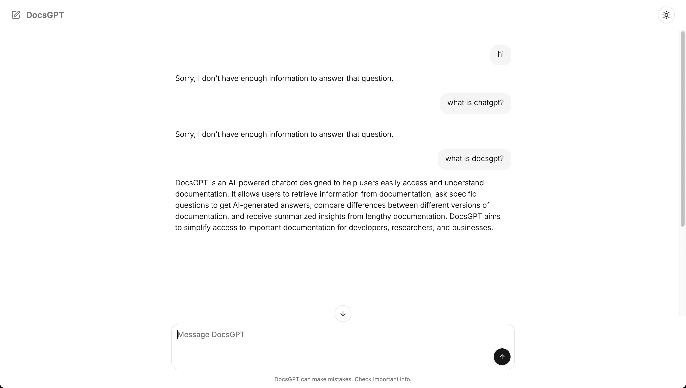

# DocsGPT 🤖📚

DocsGPT is an AI-powered documentation assistant that provides accurate answers by leveraging your documentation content. Built with modern technologies and RAG (Retrieval-Augmented Generation), it ensures responses are grounded in your actual documentation.




## Features ✨

- **Documentation-First Responses**: All answers are strictly based on your documentation content
- **Smart Retrieval**: Uses advanced embedding and semantic search to find relevant information
- **Real-Time Processing**: Visual feedback during information retrieval and processing
- **Modern UI**: Clean, responsive interface with dark/light mode support
- **Secure & Controlled**: Prevents hallucinations by only using documented information

## Tech Stack 🛠️

- **Framework**: [Next.js](https://nextjs.org/)
- **AI Integration**: [Vercel AI SDK](https://sdk.vercel.ai/docs)
- **Language Model**: OpenAI GPT-4
- **Vector Database**: PostgreSQL with [pgvector](https://github.com/pgvector/pgvector)
- **ORM**: [Drizzle ORM](https://orm.drizzle.team/)
- **Styling**: [Tailwind CSS](https://tailwindcss.com/)
- **UI Components**: [shadcn/ui](https://ui.shadcn.com/)

## Getting Started 🚀

1. **Clone the repository**
   ```bash
   git clone https://github.com/yourusername/docsgpt.git
   cd docsgpt
   ```

2. **Install dependencies**
   ```bash
   pnpm install
   ```

3. **Set up environment variables**
   ```bash
   cp .env.example .env
   ```
   Fill in your environment variables:
   - `OPENAI_API_KEY`: Your OpenAI API key
   - `DATABASE_URL`: Your PostgreSQL connection string

4. **Set up the database**
   ```bash
   pnpm db:push
   ```

5. **Ingest your documentation**
   ```bash
   pnpm tsx lib/ingest-docs.ts
   ```

6. **Start the development server**
   ```bash
   pnpm dev
   ```

## Documentation Structure 📁

Place your documentation files in the `docs` directory:
```
docs/
  ├── getting-started.mdx
  ├── api-reference.mdx
  └── ...
```

The ingestion process will:
1. Read all MDX files
2. Split content into manageable chunks
3. Generate embeddings
4. Store in the database for retrieval

## How It Works 🔄

1. **Document Ingestion**:
   - Documents are split into chunks
   - Embeddings are generated for each chunk
   - Chunks and embeddings are stored in the database

2. **Query Processing**:
   - User questions are converted to embeddings
   - Semantic search finds relevant documentation chunks
   - AI generates responses using only the retrieved content

3. **Response Generation**:
   - Responses are strictly based on documentation content
   - Visual feedback shows when information is being retrieved
   - System prevents non-documentation-based responses

## Contributing 🤝

Contributions are welcome! Please feel free to submit a Pull Request.

## License 📄

[MIT License](LICENSE)

---

Built with 💜 using the [Vercel AI SDK](https://sdk.vercel.ai/docs)
q